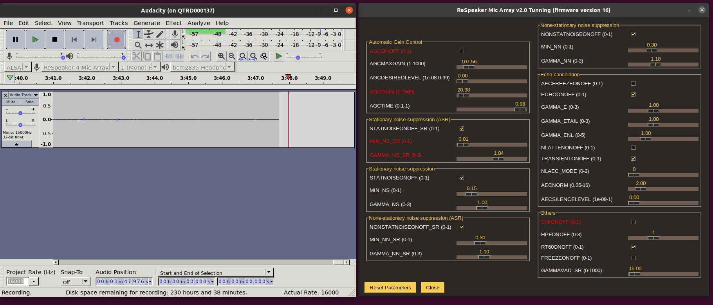

# Respeaker Mic Array V2.0 Tunning GUI
This is a simple GUI based on [ReSpeaker USB 4 Mic Array tunning software](https://github.com/respeaker/usb_4_mic_array) to adjust the Respeaker micropjone paramters. 



## Installation requirements 

``
pip3 install -r requiements.txt
``

## running
```
python3 ./tunning_gui.py
```

